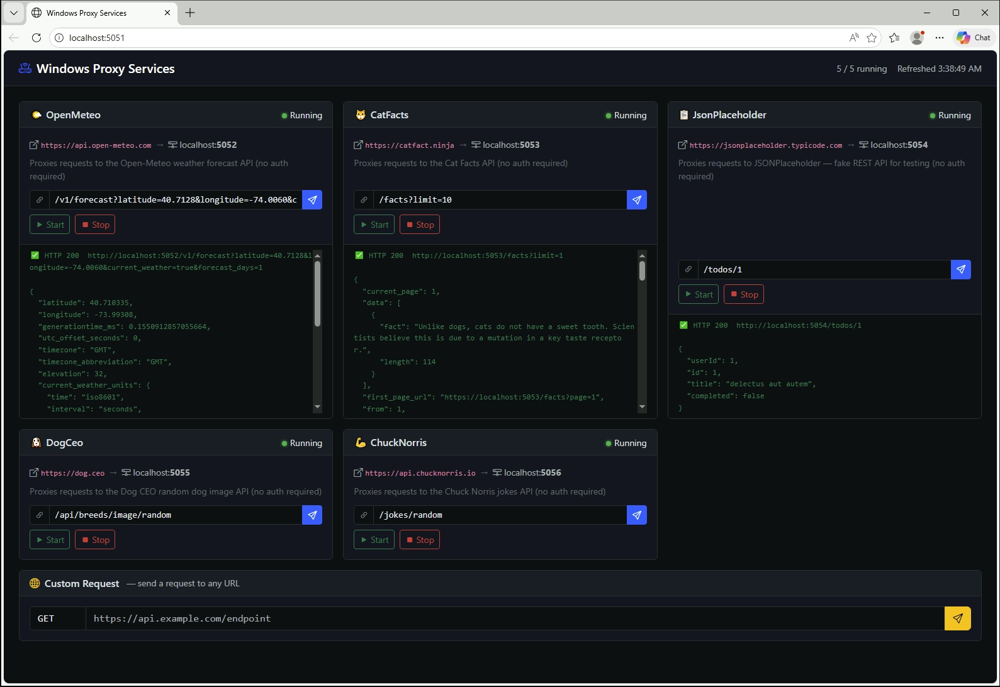
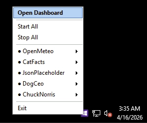
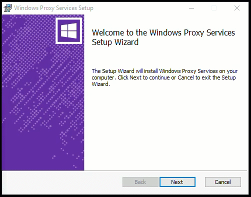

# WindowsProxyServices

A test harness for validating **Datadog SSI (Single Step Installation) auto-instrumentation** on Windows. It provisions multiple named .NET Windows Services — each a lightweight HTTP reverse proxy — giving you a realistic set of live .NET processes to target with Workload Selection rules.

A single compiled binary (`WindowsProxyService.exe`) is deployed as multiple Windows Service instances, each forwarding traffic to a different upstream URL and listening on its own port. A **web dashboard** and **system tray app** are included to make it easy to start/stop services, fire test requests, and inspect responses without touching the terminal.

## What's Included

| Component                 | Type                 | Port      | Purpose                                                  |
| ------------------------- | -------------------- | --------- | -------------------------------------------------------- |
| `WindowsProxyService`     | Windows Service (×5) | 5052–5056 | YARP reverse proxies — one per upstream API              |
| `WindowsDashboardService` | Windows Service      | 5051      | Bootstrap 5 web UI — status, test requests, start/stop   |
| `WindowsTrayApp`          | Desktop App          | —         | System tray icon — opens dashboard, start/stop shortcuts |



## Project Structure

```
src/
  WindowsProxyService/         Core proxy service (one binary, five instances)
  WindowsDashboardService/     Web dashboard + REST control API
    wwwroot/index.html         Bootstrap 5 dark-theme dashboard UI
  WindowsTrayApp/              WinForms system tray application
installer/
  Product.wxs                  WiX v4 MSI package definition
  Services.wxs                 Windows service + shortcut registrations
  License.rtf                  Installer license/disclaimer
rules.toml                     Datadog Workload Selection rules (compile before use)
```

## Quick Start

### Option A — MSI Installer (recommended)

Download the latest `WindowsProxyServices-<version>.msi` from the [Releases](https://github.com/kyletaylored/WindowsProxyServices/releases) page and run it. The installer:

- Copies all binaries to `C:\Services\WindowsProxyService\` (configurable in the GUI)
- Registers and auto-starts all five proxy services plus the dashboard service
- Creates a **Start Menu shortcut** for the tray app
- Adds the tray app to the **All Users Startup folder** so it launches automatically for every user who logs in
- Offers a **"Launch tray app"** checkbox on the final screen (checked by default) to start it immediately after install

Silent install:

```powershell
msiexec /i WindowsProxyServices-1.0.0.msi /quiet
# Custom path:
msiexec /i WindowsProxyServices-1.0.0.msi /quiet INSTALLFOLDER="D:\Custom\"
# Suppress tray app launch (recommended for automated/unattended installs):
msiexec /i WindowsProxyServices-1.0.0.msi /quiet WIXUI_EXITDIALOGOPTIONALCHECKBOX=0
```

Uninstall:

```powershell
msiexec /x WindowsProxyServices-1.0.0.msi /quiet
# or: Apps & Features → Windows Proxy Services → Uninstall
```

**Suppress the SmartScreen "Unknown Publisher" warning (one-time per server):**

Each release includes `WindowsProxyServices.cer` alongside the MSI. Import it once as Administrator and Windows will recognise the publisher on all future installs:

```powershell
Import-Certificate -FilePath WindowsProxyServices.cer -CertStoreLocation Cert:\LocalMachine\TrustedPublisher
```

### Option B — Visual Studio (local dev)

See [Local Development](#local-development) below.

---

## Local Development

### Prerequisites

- [.NET 8 SDK](https://dotnet.microsoft.com/download/dotnet/8.0)
- Visual Studio 2022 (any edition) **or** VS Code with the C# extension
- Windows (required — services and tray app are Windows-only)

### Running from the terminal

The proxy service supports starting one or multiple instances in a single process:

```powershell
# Terminal 1 — dashboard (http://localhost:5051)
dotnet run --project src/WindowsDashboardService

# Terminal 2 — all five proxy instances in one process
dotnet run --project src/WindowsProxyService -- --all

# Optional — tray app (separate window, needs dashboard running)
dotnet run --project src/WindowsTrayApp
```

Or start a subset of services:

```powershell
dotnet run --project src/WindowsProxyService -- --name OpenMeteo CatFacts
```

Open [http://localhost:5051](http://localhost:5051) to access the dashboard.

> **Tip:** When running in console mode the proxies log structured JSON to stdout. The dashboard uses HTTP port probing as a fallback when Windows services aren't registered, so status dots still reflect whether each proxy is actually up.

**`--name` argument forms:**

| Form                               | Behaviour                                      |
| ---------------------------------- | ---------------------------------------------- |
| `--name OpenMeteo`                 | Start one instance                             |
| `--name OpenMeteo CatFacts`        | Start two instances in one process             |
| `--name OpenMeteo --name CatFacts` | Same, flags repeated                           |
| `--name *` or `--all`              | Start every service defined in `services.json` |

### Running from Visual Studio

**Quickest setup — all services in two processes:**

1. Open `WindowsProxyServices.sln`.
2. Right-click `WindowsProxyService` → **Properties** → **Debug** → **General** → **Open debug launch profiles UI**.
3. Set **Command line arguments** to `--all`.
4. Right-click the **Solution** → **Properties** → **Common Properties** → **Startup Project** → **Multiple Startup Projects**.
5. Set `WindowsDashboardService` and `WindowsProxyService` to **Start**.
6. Press **F5** — the dashboard starts on port 5051 and all five proxies start on ports 5052–5056.

**Start a single proxy instance (e.g. for focused debugging):**

Set the command line arguments to `--name OpenMeteo` (or whichever service you want) instead of `--all`. To run additional instances alongside it, open terminals and `dotnet run` with the remaining names.

**Run the tray app:**

Add `WindowsTrayApp` to the Multiple Startup Projects list, or start it separately from a terminal.

---

## Dashboard

The **Windows Dashboard Service** runs at [http://localhost:5051](http://localhost:5051) and provides:

- **Live status cards** for each proxy service, auto-refreshing every 5 seconds
- **Editable path input** per card — pre-filled with a default test path; press Enter or click Send to fire a GET request through the proxy and see the formatted JSON response inline
- **Custom Request card** — enter any full URL, choose GET or POST (with optional JSON body), and fire the request directly through the dashboard service
- **Start / Stop buttons** — controls each Windows service directly (the dashboard runs as LocalSystem so no elevation prompt is needed)

The dashboard is itself a Windows service (`WindowsDashboardService`) so it starts automatically with Windows after an MSI install.

**REST API (used by the dashboard UI and tray app):**

| Method | Path                         | Description                                                                        |
| ------ | ---------------------------- | ---------------------------------------------------------------------------------- |
| `GET`  | `/api/services`              | List all services with status, port, upstream URL                                  |
| `POST` | `/api/services/{name}/test`  | Fire a GET request through the named proxy; optional body `{"path":"/custom"}`     |
| `POST` | `/api/services/{name}/start` | Start the named Windows service                                                    |
| `POST` | `/api/services/{name}/stop`  | Stop the named Windows service                                                     |
| `POST` | `/api/custom-request`        | Fire a GET or POST to any URL; body: `{"url":"…","method":"GET\|POST","body":"…"}` |

Example:

```powershell
# List all services and their status
Invoke-RestMethod http://localhost:5051/api/services

# Test the ChuckNorris proxy
Invoke-RestMethod -Method Post http://localhost:5051/api/services/ChuckNorris/test

# Stop the DogCeo proxy
Invoke-RestMethod -Method Post http://localhost:5051/api/services/DogCeo/stop
```

## Tray App

`WindowsTrayApp.exe` sits in the system tray and gives quick access to everything without opening a browser or terminal.

- **Double-click** the icon → opens the dashboard in your default browser
- **Right-click** → context menu:
  - **Open Dashboard** — opens [http://localhost:5051](http://localhost:5051)
  - **Start All / Stop All** — controls all proxy services at once _(admin only)_
  - Per-service **Start / Stop** sub-menus (status dot `●`/`○` updates when you open the menu) _(admin only)_
  - **Exit**



Start/Stop controls are **disabled for non-admin users**. Any user can open the dashboard and view service status; only administrators can start or stop services. The tray app delegates start/stop to the dashboard API, so it needs `WindowsDashboardService` to be running. If the dashboard is unreachable it shows a warning message.

After an MSI install the tray app **launches automatically for all users at login** via the All Users Startup folder. It can also be launched manually from **Start Menu → Windows Proxy Services Tray** or directly from `C:\Services\WindowsProxyService\WindowsTrayApp.exe`.

---

## Configuration — services.json

Defines all proxy instances. Located at `src/WindowsProxyService/services.json` (copied alongside the exe at publish time).

```json
[
  {
    "InstanceName": "OpenMeteo",
    "ServiceDescription": "Proxies requests to the Open-Meteo weather forecast API (no auth required)",
    "Host": "+",
    "Port": 5052,
    "ProxyUrl": "https://api.open-meteo.com"
  },
  {
    "InstanceName": "CatFacts",
    "ServiceDescription": "Proxies requests to the Cat Facts API (no auth required)",
    "Host": "+",
    "Port": 5053,
    "ProxyUrl": "https://catfact.ninja"
  },
  {
    "InstanceName": "JsonPlaceholder",
    "ServiceDescription": "Proxies requests to JSONPlaceholder — fake REST API for testing (no auth required)",
    "Host": "+",
    "Port": 5054,
    "ProxyUrl": "https://jsonplaceholder.typicode.com"
  },
  {
    "InstanceName": "DogCeo",
    "ServiceDescription": "Proxies requests to the Dog CEO random dog image API (no auth required)",
    "Host": "+",
    "Port": 5055,
    "ProxyUrl": "https://dog.ceo"
  },
  {
    "InstanceName": "ChuckNorris",
    "ServiceDescription": "Proxies requests to the Chuck Norris jokes API (no auth required)",
    "Host": "+",
    "Port": 5056,
    "ProxyUrl": "https://api.chucknorris.io"
  }
]
```

| Field          | Description                                                                                                                                                           |
| -------------- | --------------------------------------------------------------------------------------------------------------------------------------------------------------------- |
| `InstanceName` | Matches the `--name` value. Windows Service name is `WindowsProxyService.<InstanceName>`. Pass multiple names or `--all` to start more than one instance per process. |
| `Host`         | `+` listens on all interfaces (Kestrel wildcard).                                                                                                                     |
| `Port`         | Port this instance binds to.                                                                                                                                          |
| `ProxyUrl`     | Upstream base URL. All incoming paths and query strings are forwarded.                                                                                                |

---

## Datadog SSI — Workload Selection

This project exists to test Datadog's **host-level SSI auto-instrumentation** for .NET on Windows. With SSI enabled, the Datadog tracer automatically attaches to .NET processes on startup. **Workload Selection** rules let you control exactly which processes are instrumented.

### Prerequisites

1. Install the Datadog Agent with SSI enabled:

```powershell
$p = Start-Process -Wait -PassThru msiexec -ArgumentList '/qn /i "https://windows-agent.datadoghq.com/datadog-agent-7-latest.amd64.msi" /log C:\Windows\SystemTemp\install-datadog.log APIKEY="<YOUR_API_KEY>" SITE="datadoghq.com" DD_APM_INSTRUMENTATION_ENABLED="host" DD_APM_INSTRUMENTATION_LIBRARIES="dotnet:3"'
```

2. Install the rule compiler:

```powershell
Invoke-WebRequest -Uri "https://github.com/DataDog/dd-policy-engine/releases/download/v0.1.1/dd-rules-converter-win-x64.zip" -OutFile "dd-rules-converter.zip"
Expand-Archive -Path "dd-rules-converter.zip" -DestinationPath "C:\tools"
```

### Compile and apply rules.toml

Edit `rules.toml` in the repo root, then compile it:

```powershell
C:\tools\dd-rules-converter.exe -rules rules.toml -output "C:\ProgramData\Datadog\managed\rc-orgwide-wls-policy.bin"
```

The tracer loads the compiled policy automatically the next time a .NET process starts — no agent restart needed. Restart the proxy services to pick up new rules:

```powershell
Get-Service WindowsProxyService.* | Restart-Service
```

### How the proxy services map to rule selectors

All proxy instances share one binary, so `process.executable` matches all of them at once. Use `dotnet.dll` or a naming convention for per-instance targeting.

| Selector             | Value                         | Matches                        |
| -------------------- | ----------------------------- | ------------------------------ |
| `process.executable` | `WindowsProxyService.exe`     | All proxy instances            |
| `process.executable` | `*ProxyService.exe`           | All proxy instances (wildcard) |
| `dotnet.dll`         | `WindowsProxyService.dll`     | All proxy instances (by DLL)   |
| `process.executable` | `WindowsDashboardService.exe` | Dashboard service only         |

### Example rules (see rules.toml for full file)

```toml
[instrument-all-proxy-instances]
description = "Instrument all WindowsProxyService instances"
instrument  = true
expression  = "process.executable:WindowsProxyService.exe runtime.language:dotnet"

[instrument-by-name-suffix]
description = "Instrument any .NET process whose executable ends with ProxyService.exe"
instrument  = true
expression  = "process.executable:*ProxyService.exe runtime.language:dotnet"
```

### Troubleshooting

Enable debug logging to inspect rule evaluation:

```powershell
$env:DD_TRACE_DEBUG = "true"
$env:DD_TRACE_LOG_DIRECTORY = "C:\logs\datadog"
```

Confirm the compiled policy file exists:

```
C:\ProgramData\Datadog\managed\rc-orgwide-wls-policy.bin
```

---

## Validate

### Using the Dashboard

Open [http://localhost:5051](http://localhost:5051) — click **Test** on any card to fire a request through that proxy and see the live response. Status badges refresh automatically every 5 seconds.

### Using PowerShell

**Status endpoint (each proxy instance):**

```powershell
Invoke-RestMethod http://localhost:5052/api/status
Invoke-RestMethod http://localhost:5053/api/status
Invoke-RestMethod http://localhost:5054/api/status
Invoke-RestMethod http://localhost:5055/api/status
Invoke-RestMethod http://localhost:5056/api/status
```

**WindowsProxyService.OpenMeteo — port 5052**

```powershell
# Current weather for Dallas, TX
Invoke-RestMethod "http://localhost:5052/v1/forecast?latitude=32.78&longitude=-96.80&current_weather=true"

# Hourly temperature for the next 3 days
Invoke-RestMethod "http://localhost:5052/v1/forecast?latitude=32.78&longitude=-96.80&hourly=temperature_2m,windspeed_10m&forecast_days=3"
```

**WindowsProxyService.CatFacts — port 5053**

```powershell
Invoke-RestMethod "http://localhost:5053/fact"
Invoke-RestMethod "http://localhost:5053/facts?page=1&limit=5"
```

**WindowsProxyService.JsonPlaceholder — port 5054**

```powershell
Invoke-RestMethod "http://localhost:5054/posts/1"
Invoke-RestMethod "http://localhost:5054/posts/1/comments"

# Simulated POST (returns the created resource)
Invoke-RestMethod "http://localhost:5054/posts" -Method Post `
  -ContentType "application/json" `
  -Body '{"title":"Test","body":"Hello proxy","userId":1}'
```

**WindowsProxyService.DogCeo — port 5055**

```powershell
Invoke-RestMethod "http://localhost:5055/api/breeds/image/random"
Invoke-RestMethod "http://localhost:5055/api/breeds/list/all"
```

**WindowsProxyService.ChuckNorris — port 5056**

```powershell
Invoke-RestMethod "http://localhost:5056/jokes/random"
Invoke-RestMethod "http://localhost:5056/jokes/random?category=science"
Invoke-RestMethod "http://localhost:5056/jokes/categories"
```

---

## Datadog RUM

The dashboard can optionally load the Datadog Browser SDK to send Real User Monitoring data. RUM is **disabled by default** — the page only initialises the SDK when `applicationId` is non-empty in `wwwroot/rum-config.json`.

### Configuration paths

**1 — Edit `rum-config.json` directly (dev / post-install)**

Edit `C:\Services\WindowsProxyService\wwwroot\rum-config.json` and fill in the required fields. The dashboard picks up the new values on its next startup (restart `WindowsDashboardService`).

```json
{
  "applicationId": "aea2638b-...",
  "clientToken": "pub35af...",
  "site": "us3.datadoghq.com",
  "service": "windows-proxy-services",
  "env": "prod",
  "version": "1.2.3",
  "sessionSampleRate": 100,
  "sessionReplaySampleRate": 20,
  "allowedTracingUrls": ["http://localhost"]
}
```

**2 — MSI installer dialog (GUI install)**

A dedicated dialog page is shown between the install directory and the ready-to-install screen. Enter App ID, Client Token, select your site from the dropdown (all six Datadog regions), and set an environment name. Leave all fields blank to keep RUM disabled.



Values are written to `HKLM\SOFTWARE\WindowsProxyServices\RUM`. On first start, `WindowsDashboardService` reads the registry and regenerates `rum-config.json` automatically.

**3 — Silent / automated MSI install**

Pass the values on the `msiexec` command line:

```powershell
msiexec /i WindowsProxyServices.msi /quiet `
  DD_RUM_APP_ID="aea2638b-..." `
  DD_RUM_CLIENT_TOKEN="pub35af..." `
  DD_RUM_SITE="us3.datadoghq.com" `
  DD_RUM_ENV="prod"
```

**4 — GitHub Actions / CI silent install**

To exercise the RUM code path in the smoke-test job, set the following in your repo/org settings. The release workflow passes them as `msiexec` properties during the silent install, following the exact same registry path as an interactive GUI install:

| Name                  | Type     | Description                                                           |
| --------------------- | -------- | --------------------------------------------------------------------- |
| `DD_RUM_APP_ID`       | Secret   | RUM application ID                                                    |
| `DD_RUM_CLIENT_TOKEN` | Secret   | RUM client token                                                      |
| `DD_RUM_SITE`         | Variable | Datadog site (e.g. `us3.datadoghq.com`) — defaults to `datadoghq.com` |
| `DD_RUM_ENV`          | Variable | Environment name — defaults to `ci`                                   |

If `DD_RUM_APP_ID` is not set, the installer runs without RUM and the `window.DD_RUM` check in the Playwright smoke test is skipped rather than failed.

> **Note:** RUM values are never baked into the MSI at build time. The shipped MSI always has RUM disabled by default; values only reach the dashboard at runtime via the registry path populated by the installer.

### Supported sites

| Dropdown label | `site` value        |
| -------------- | ------------------- |
| US1            | `datadoghq.com`     |
| US3            | `us3.datadoghq.com` |
| US5            | `us5.datadoghq.com` |
| EU1            | `datadoghq.eu`      |
| AP1            | `ap1.datadoghq.com` |
| US1-FED        | `ddog-gov.com`      |

---

## CI / Releases

The release workflow (`.github/workflows/release.yml`) runs automatically on a semver tag push and can also be triggered manually from the Actions tab to produce a test MSI without creating a release.

**Job progression:**

```
version  →  build  →  smoke-test  →  release (tag push only)
```

| Job          | Runner  | What it does                                                                                                                                                                                                                                                                     |
| ------------ | ------- | -------------------------------------------------------------------------------------------------------------------------------------------------------------------------------------------------------------------------------------------------------------------------------- |
| `version`    | ubuntu  | Resolves semver and MSI version strings; exports them as job outputs                                                                                                                                                                                                             |
| `build`      | windows | `dotnet publish` all three projects, generates `Files.wxs`, builds the MSI, uploads it as a workflow artifact                                                                                                                                                                    |
| `smoke-test` | windows | Installs the MSI silently (optionally passing `DD_RUM_*` secrets as `msiexec` properties), polls all six services until `Running`, probes each HTTP endpoint, runs a headless Playwright browser test against the dashboard, then uninstalls. Uploads installer logs on failure. |
| `release`    | ubuntu  | Downloads the artifact and publishes a GitHub Release with auto-generated release notes                                                                                                                                                                                          |

The Playwright browser test navigates to `http://localhost:5051`, asserts service cards are visible, validates `rum-config.json` is valid JSON, and — when `DD_RUM_APP_ID` is set — asserts `window.DD_RUM` was initialised. The RUM assertion is silently skipped when credentials are not configured.

### Code Signing Setup

The release workflow signs the MSI with a self-signed certificate when two secrets are configured. The MSI is unsigned (but otherwise identical) without them.

| Secret                  | Description                                                 |
| ----------------------- | ----------------------------------------------------------- |
| `SIGNING_CERT_PFX`      | Base64-encoded PFX containing the private + public key pair |
| `SIGNING_CERT_PASSWORD` | Password used when the PFX was exported                     |

Generate the certificate once on any Windows machine (10-year validity):

```powershell
$pfxPath = "$env:TEMP\signing.pfx"

$cert = New-SelfSignedCertificate `
  -Type CodeSigning `
  -Subject "CN=Windows Proxy Services" `
  -CertStoreLocation Cert:\CurrentUser\My `
  -NotAfter (Get-Date).AddYears(10) `
  -HashAlgorithm SHA256

$pwd = ConvertTo-SecureString "your-strong-password" -AsPlainText -Force
Export-PfxCertificate -Cert $cert -FilePath $pfxPath -Password $pwd

# Encode as base64 and paste into the SIGNING_CERT_PFX secret
[Convert]::ToBase64String([IO.File]::ReadAllBytes($pfxPath)) | clip

Remove-Item $pfxPath   # never commit the private key
```

Add `SIGNING_CERT_PFX` (base64 output) and `SIGNING_CERT_PASSWORD` as repo or org secrets. The CI will then sign every MSI and export `WindowsProxyServices.cer` as a release asset. The same certificate is reused for all releases, so servers only need to import it once.

**Create a release:**

```powershell
git tag v1.2.3 && git push --tags
```

**Trigger a dev build (no release):**

Go to **Actions → Release → Run workflow** and optionally enter a version string. Leave it blank to get `0.0.0-dev.<run_number>`. The built MSI is available as a workflow artifact for 14 days.

---

## Windows Service Names

| Service Name                          | Port | Upstream                             |
| ------------------------------------- | ---- | ------------------------------------ |
| `WindowsProxyService.OpenMeteo`       | 5052 | https://api.open-meteo.com           |
| `WindowsProxyService.CatFacts`        | 5053 | https://catfact.ninja                |
| `WindowsProxyService.JsonPlaceholder` | 5054 | https://jsonplaceholder.typicode.com |
| `WindowsProxyService.DogCeo`          | 5055 | https://dog.ceo                      |
| `WindowsProxyService.ChuckNorris`     | 5056 | https://api.chucknorris.io           |
| `WindowsDashboardService`             | 5051 | _(serves the local dashboard UI)_    |

## Log Format

Each proxy service emits single-line JSON:

```json
{
  "Timestamp": "2026-03-05 10:15:00",
  "Level": "Information",
  "Message": "Proxy 'OpenMeteo' starting on +:5052, forwarding to https://api.open-meteo.com",
  "Category": "WindowsProxyService.Program",
  "Scopes": [{ "Instance": "OpenMeteo" }]
}
```
